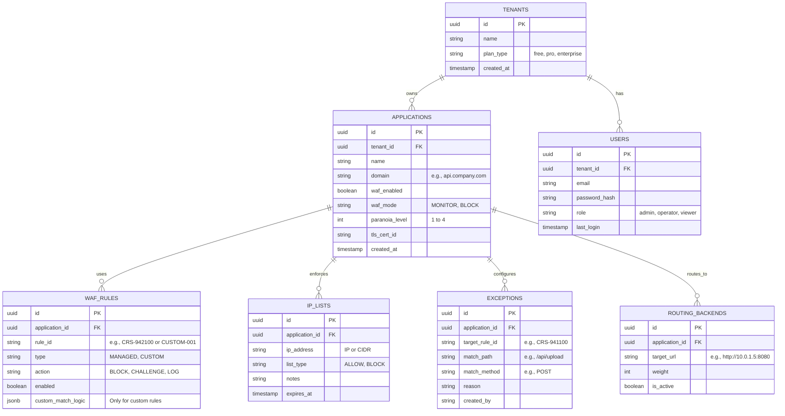

# Database Schema - WAF Pro SaaS

Schema database (PostgreSQL) difokuskan pada manajemen Control Plane, menyimpan data tentang *tenants*, aplikasi (domains), *rules*, *exceptions*, dan manajemen pengguna. Log inspeksi trafik tidak disimpan di sini, melainkan di Loki/OpenSearch.

## 1. ERD (Entity Relationship Diagram)

## 2. Table Specifications

### `applications`
Menyimpan konfigurasi utama dari situs/API yang dilindungi.
*   **waf_mode**: Sangat penting. Jika `MONITOR`, semua evaluasi WAF yang menghasilkan `BLOCK` akan diubah menjadi `LOG` saja.
*   **paranoia_level**: Menentukan seberapa ketat *OWASP Core Rule Set* dieksekusi. Level 1 (Default, false-positive rendah) hingga Level 4 (Sangat ketat).

### `waf_rules`
Tabel ini digunakan jika *tenant* ingin mengubah perilaku default dari sebuah rule (misalnya mengubah tindakan dari BLOCK menjadi CHALLENGE) atau jika mereka membuat *Custom Rule*. 
*   **custom_match_logic (JSONB)**: Menyimpan definisi struktur rule kustom. Contoh isi: `{"methods": ["POST"], "paths": ["/login"], "headers": {"User-Agent": "curl"}}`.

### `exceptions`
Fitur *tuning* utama untuk mengurangi *false positive*.
Jika sebuah rule (contoh `CRS-941100` XSS) terpicu secara salah (false positive) pada endpoint `/api/upload` dengan method `POST`, konfigurasi ini memastikan rule tersebut tidak dievaluasi pada path/method tersebut.

### `ip_lists`
Mendukung *Allowlist* (Bypass WAF) dan *Denylist* (Langsung blokir pada fase awal request/TCP connection).
*   **expires_at**: Berguna untuk pemblokiran otomatis dari respon insiden yang bersifat sementara (misal: "Blokir IP ini selama 24 jam").

## 3. Redis Schema (Rate Limiting & Caching)

Redis tidak menggunakan skema relasional, melainkan key-value.

*   **Key Rate Limiting**: `ratelimit:{app_id}:{ip_address}:{path}`
*   **Value**: Integer (Counter request)
*   **TTL**: Expiry time sesuai window rate limit (misal: 60 detik).
*   **WAF State/Session**: Digunakan oleh Coraza untuk menyimpan state *collections* sementara antar request (misal untuk deteksi *brute force*).
